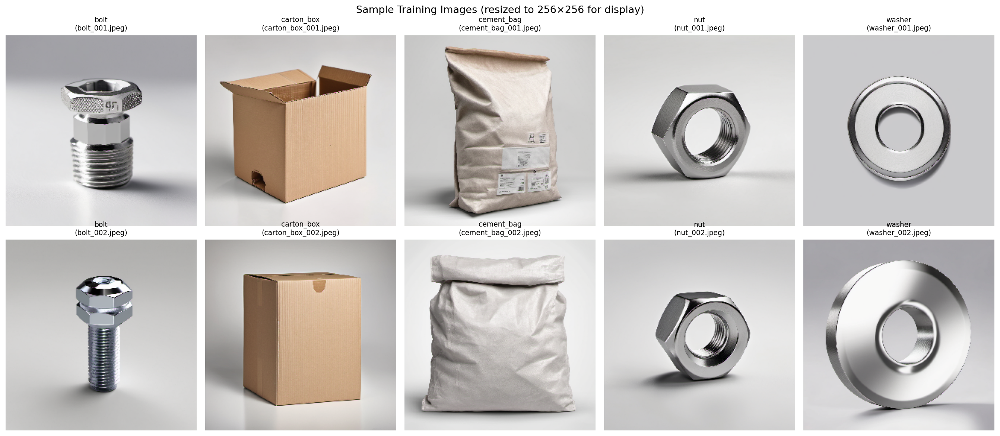
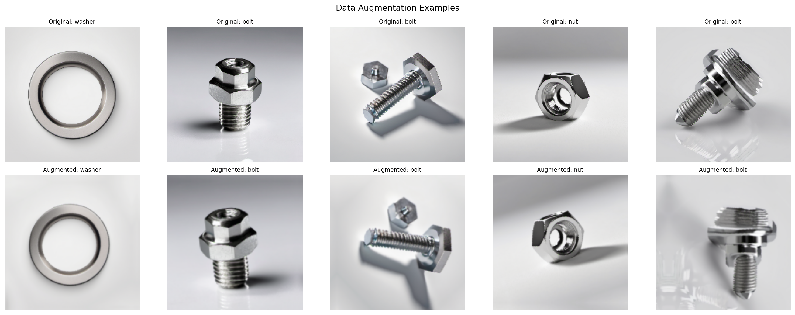
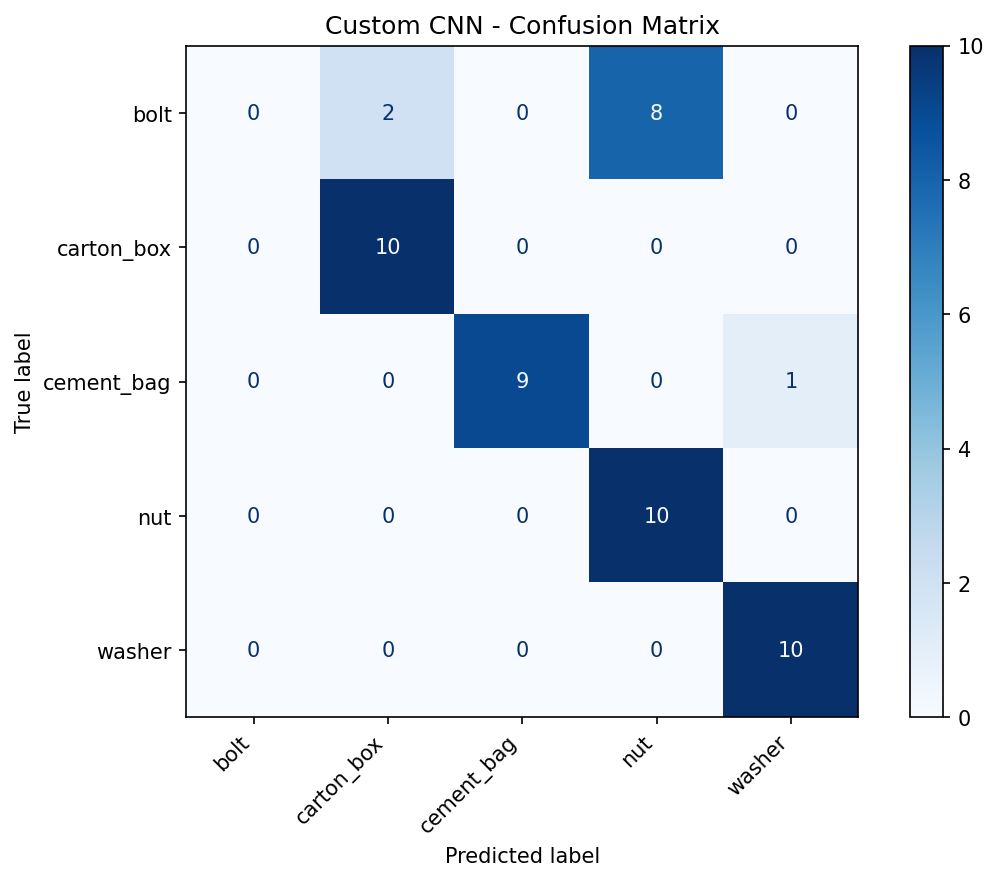
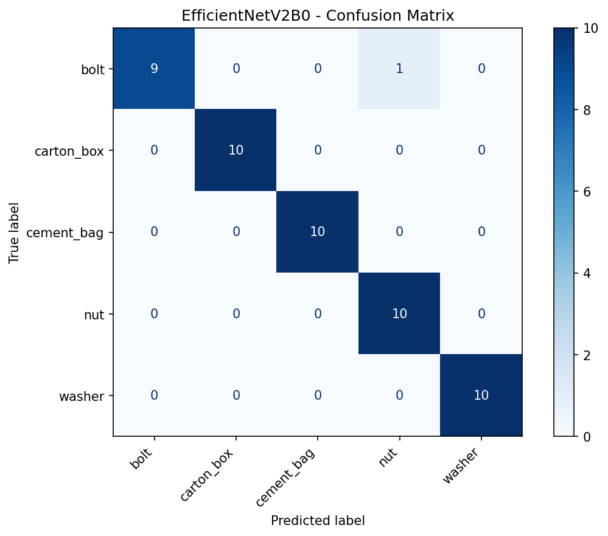
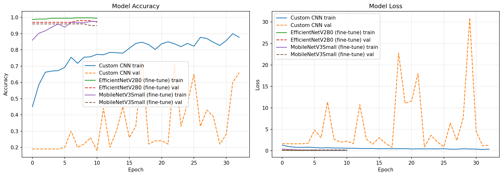
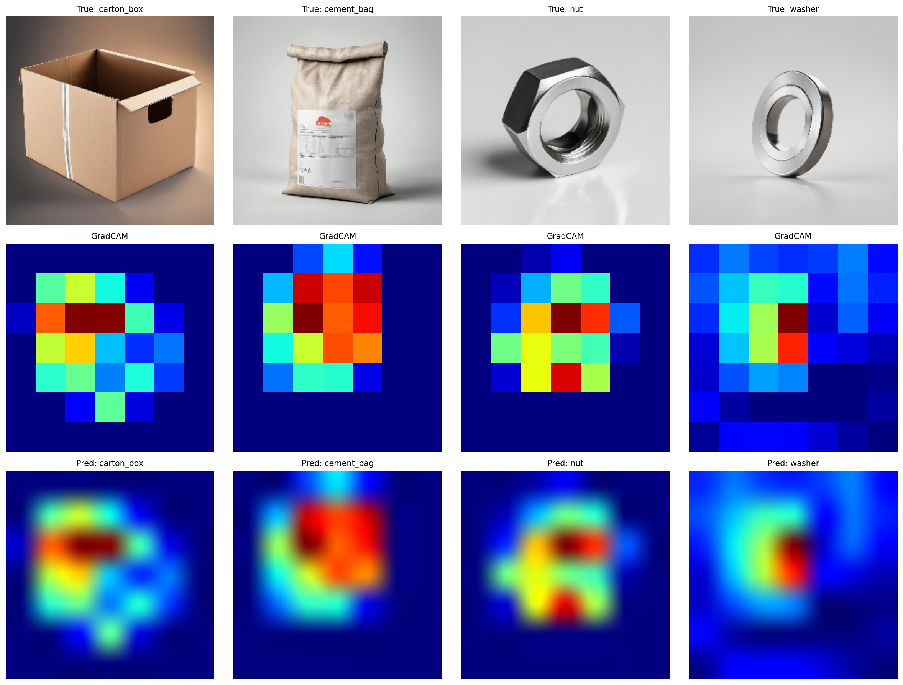
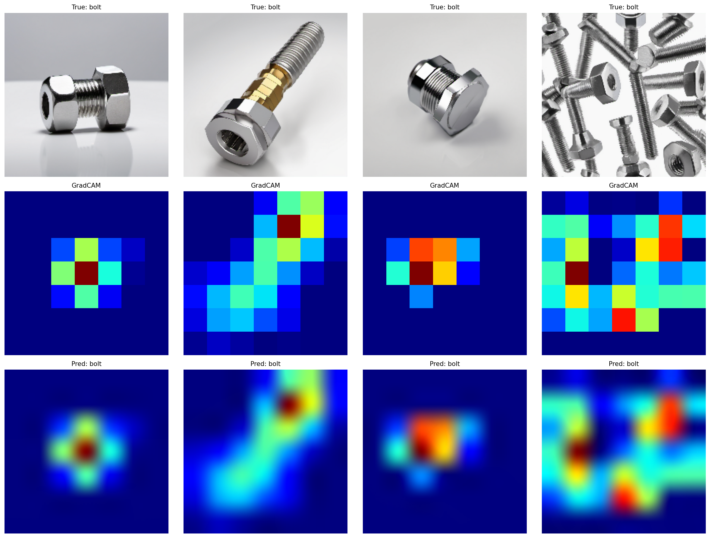
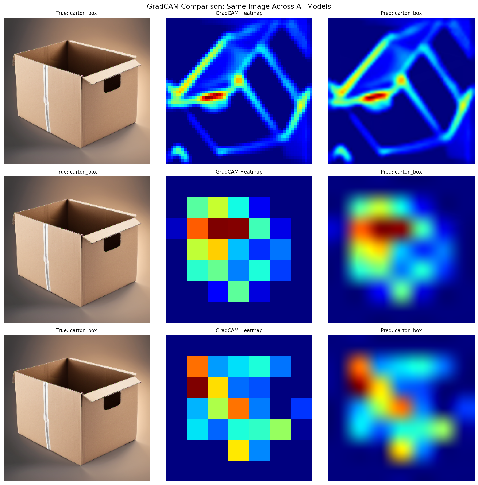

# Solution Assignment 5: Image Classification with CNNs
**Buinitskii Stanislav**

**Repository:** https://github.com/stasais/ndl/tree/assignment-5-done

---

**Note:** All training images were generated locally on my machine using Stable Diffusion XL 1.0 (running on an NVIDIA RTX 4070). None of the images are taken from the internet.

---

## Overview

For this assignment I built and compared CNN models for classifying images of **industrial parts** — bolts, carton boxes, cement bags, nuts, and washers. I went with AI-generated images because it let me quickly get a clean, balanced dataset without scraping the web. I trained three models: a custom CNN from scratch, and two transfer learning approaches (EfficientNetV2B0 and MobileNetV3Small). I also used GradCAM to see what the models actually look at when making predictions.

---

## 1. Dataset

| Property | Value |
|----------|-------|
| Classes | bolt, carton_box, cement_bag, nut, washer |
| Train images | 500 (100 per class) |
| Test images | 50 (10 per class) |
| Original resolution | 1024 × 1024 RGB |
| Generator | SDXL 1.0 on RTX 4070 |

I picked industrial parts because it's a practical use case (quality control, warehouse sorting). Generating images with SDXL gave me full control over the dataset — I could make sure each class has exactly 100 images with different angles and backgrounds. The dataset is intentionally small (500 images total) so that the difference between training from scratch and transfer learning becomes obvious.

---

## 2. Preprocessing

All images were resized to **224×224** since that's what the pretrained models expect (ImageNet input size), and it works fine for the custom CNN too.

| Step | Choice | Why |
|------|--------|-----|
| Resize | 224×224 | Needed for pretrained models, keeps enough detail |
| Normalization | [0, 1] for custom CNN; [-1, 1] for pretrained | Each pretrained model has its own expected range |
| Train/Val split | 80/20 from training set | Test folder kept completely separate |
| Batch size | 16 | With only 500 images, smaller batches = more weight updates per epoch |

I skipped grayscale conversion (color helps tell apart brown cement bags from shiny metal bolts), manual cropping (SDXL already centers objects), and class weighting (dataset is balanced anyway).

---

## 3. Data Augmentation

Only 100 images per class, so augmentation is pretty much required to avoid overfitting.

| Augmentation | Used? | Why / Why not |
|-------------|-------|---------------|
| Horizontal Flip | Yes | Parts can face either way |
| Rotation (±15%) | Yes | Objects might be slightly rotated |
| Zoom (±10%) | Yes | Simulates different camera distances |
| Translation (±10%) | Yes | Objects not always perfectly centered |
| Vertical Flip | No | Doesn't make sense for objects on a surface |
| Color Jitter | No | With only 100 images, random color changes would probably do more harm than good |

I put the augmentation layers directly into each model as a Keras `Sequential` block, so they only apply during training.

---

## 4. Model 1: Custom CNN from Scratch

### Architecture

I started from the CNN we built in exercise 10 (CIFAR-10) and adapted it for 224×224 input and 5 classes:

- **3 convolutional blocks** with increasing filters (32 → 64 → 128), each with 2×Conv2D + BatchNorm + ReLU + MaxPool
- **GlobalAveragePooling2D** instead of Flatten — way fewer parameters this way
- **Dense(128) + Dropout(0.4)** — high dropout since the dataset is so small
- **Adam optimizer, lr=1e-3**
- **Early stopping** (patience=15, restore best weights)
- Total: **305,957 parameters**

### Why these choices?

- I used 3 blocks instead of 2 (like in exercise 10) because the input is much larger (224×224 vs 32×32), so I need more pooling to bring the spatial dimensions down
- BatchNorm helps stabilize training — we saw this in exercise 8
- GAP instead of Flatten because otherwise the Dense layer after flattening 28×28×128 would be huge
- Dropout at 0.4 is pretty high, but with only 500 training images I figured it's better to regularize too much than too little

### Results

- **Test accuracy: 78.00%**
- **Test loss: 0.7119**
- The model can't classify **bolts** at all — every single test bolt gets predicted as nut or carton box
- Works well for carton_box (100%), cement_bag (90%), nut (100%), washer (100%)

---

## 5. Model 2: EfficientNetV2B0 (Transfer Learning)

### Why EfficientNetV2B0?

- We already used it in exercises 10 and 11, so I'm familiar with it
- Pretrained on ImageNet (14M images, 1000 classes) — it already knows a lot about visual features
- V2B0 is the smallest EfficientNet variant, so less likely to overfit on my small dataset

### Two-Phase Training

1. **Phase 1 — Frozen base (15 epochs):** I freeze the whole pretrained network and only train the new classification head (GAP → Dense(128) → Dropout(0.3) → Dense(5)). This way the random head weights don't mess up the pretrained features with big gradients.
2. **Phase 2 — Fine-tune top 20 layers (20 epochs):** Unfreeze the last 20 layers and train with a much lower learning rate (1e-5). Early stopping with patience=10.

Total: **6,083,925 parameters**

### Results

- **Test accuracy: 98.00%**
- **Test loss: 0.0756**
- Only 1 error: a bolt misclassified as a nut

---

## 6. Model 3: MobileNetV3Small (Transfer Learning)

### Why MobileNetV3Small?

- I wanted to try something smaller and more lightweight as a contrast to EfficientNet
- Way fewer parameters, so less overfitting risk
- It's designed for mobile/edge devices, which would actually make sense for a real industrial setup (classifying parts on the production line with a small device)

### Same two-phase training, but fine-tuning top 30 layers.

Total: **1,013,621 parameters**

### Results

- **Test accuracy: 98.00%**
- **Test loss: 0.1139**
- Same single mistake: one bolt predicted as nut

---

## 7. Model Comparison

### Results Summary

| Model | Test Accuracy | Test Loss | Parameters |
|-------|:------------:|:---------:|:----------:|
| Custom CNN | 78.00% | 0.7119 | 305,957 |
| EfficientNetV2B0 | **98.00%** | **0.0756** | 6,083,925 |
| MobileNetV3Small | **98.00%** | 0.1139 | 1,013,621 |

### Training Curves

### What I noticed

**Transfer learning wins by a lot.** With only 500 training images the custom CNN just doesn't have enough data to learn good features on its own. It especially struggles to tell bolts from nuts — both are small metallic hexagonal objects, so without pretrained knowledge about shapes and textures it gets confused.

**Custom CNN overfits badly.** Training accuracy goes up to ~90% but validation jumps around between 20-70%. Early stopping kicked in at epoch 33 and restored weights from epoch 18.

**EfficientNet vs. MobileNet:** Both hit 98% and both make the same single mistake (bolt → nut). EfficientNet has slightly lower test loss (0.076 vs. 0.114), so its predictions are a bit more confident. But MobileNet is about 6× smaller (1M vs. 6M params), which matters if you actually wanted to deploy this.

**Both pretrained models learn really fast** in phase 1 (frozen base) — they're already at 97%+ validation accuracy after just 1-2 epochs. Fine-tuning only helps a tiny bit.

---

## 8. GradCAM Analysis

GradCAM (Gradient-weighted Class Activation Mapping) shows which parts of the image the model looks at when classifying. I reused the implementation from exercise 11.

### Correctly Classified Images (EfficientNetV2B0)

The heatmaps show that EfficientNet looks at the right places — the center of boxes, the body of cement bags, the shape of nuts and washers. That's a good sign.

### Misclassified Images (EfficientNetV2B0)

For the bolt images that got misclassified, the model focuses on the hexagonal head, which honestly looks a lot like a nut from above. That explains why it keeps mixing them up.

### Cross-Model Comparison

I ran GradCAM on the same image with all three models to compare:
- **EfficientNet** has clean, focused heatmaps on the object
- **MobileNet** is similar but a bit more spread out
- **Custom CNN** has much more scattered activations — it clearly hasn't learned to focus on the object properly

---

## 9. What Could Be Improved

- More training data (maybe 200-500 per class) would probably help the custom CNN a lot
- Could try Mixup or CutMix augmentation for more variety
- Learning rate scheduling (like cosine annealing) for the custom CNN
- An ensemble of all three models might squeeze out a bit more accuracy
- Would be interesting to test on real photos instead of AI-generated ones to see if the models generalize

---

## 10. Code Reuse from Exercises

- **Exercise 10:** CNN architecture pattern (conv blocks + BatchNorm + MaxPool), `train_model_ds()`, `eval_classification()`, `plot_training_history()`
- **Exercise 11:** GradCAM implementation (`make_gradcam_heatmap`, `create_gradcam_visualization`, `show_gradcam_grid`) from `gradcam.py`
- **Exercise 8:** BatchNorm and Dropout patterns
- **Assignment 4:** Adam optimizer, early stopping setup

All helper functions are in `utils.py`.

---

## LLM Usage

Used GitHub Copilot for code completion and boilerplate. Architecture decisions, hyperparameters, augmentation choices, and the analysis were done by me based on what we covered in exercises 8-11.
